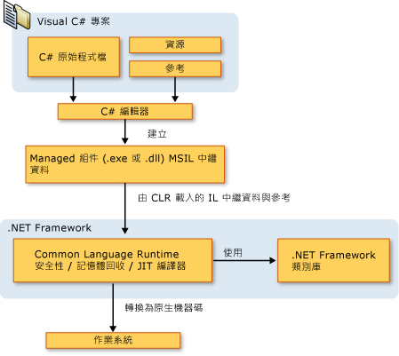

# Introduction to the C# Language and the .NET Framework
[!INCLUDE[vs2017banner](../../csharp/includes/vs2017banner.md)]

C\# 是一種簡潔且類型安全 \(Type\-Safe\) 的物件導向語言，讓開發人員能夠建置各種可以在 [!INCLUDE[dnprdnshort](../../csharp/getting-started/includes/dnprdnshort_md.md)] 上執行的安全、強固應用程式。  您可以使用 C\# 來建立 Windows 用戶端應用程式、XML Web Services、分散式元件、主從式應用程式、資料庫應用程式以及更多程式。  Visual C\# 提供進階的程式碼編輯器、便利的使用者介面設計工具、整合式偵錯工具以及許多其他工具，用以簡化根據 C\# 語言及 [!INCLUDE[dnprdnshort](../../csharp/getting-started/includes/dnprdnshort_md.md)] 來開發應用程式的程序。  
  
> [!NOTE]
>  [!INCLUDE[csprcs](../../csharp/includes/csprcs_md.md)] 文件假設您已了解基本的程式設計概念。  如果您是初學者，就可能需要先至網站上深入了解 [!INCLUDE[csprcsxpr](../../csharp/getting-started/includes/csprcsxpr_md.md)]。  您也可以利用有關 C\# 的書籍和 Web 資源來學習實際的程式設計技巧。  
  
## C\# 語言  
 C\# 語法具有高度表達能力，同時也是相當簡單並容易學習的語法。  熟悉 C、C\+\+ 或 Java 的任何人員都能立即辨識 C\# 的大括號語法。  任何了解上述其中一種語言的開發人員，一般都能在極短的時間內開始使用 C\# 進行工作。  C\# 語法將 C\+\+ 的複雜度簡化了許多，同時提供強大的功能，例如可為 Null 的實值類型 \(Value Type\)、列舉類型 \(Enumeration\)、委派 \(Delegate\)、Lambda 運算式及直接記憶體存取，而這些都是 Java 沒有的功能。  C\# 支援泛型方法和類型 \(會提供增強的類型安全 \(Type Safety\) 和效能\) 以及迭代器 \(可讓集合類別 \(Collection Class\) 的實作器定義自訂反覆運算行為，由用戶端程式碼輕鬆運用\)。  [!INCLUDE[vbteclinqext](../../csharp/getting-started/includes/vbteclinqext_md.md)] 運算式會將強類型查詢當成第一級語言建構。  
  
 C\# 是物件導向語言，因此支援封裝 \(Encapsulation\)、繼承 \(Inheritance\) 和多型 \(Polymorphism\) 的概念。  所有的變數和方法，包括 `Main` 方法，也就是應用程式的進入點 \(Entry Point\)，都封裝在類別定義之內。  類別可能直接從一個父類別繼承，不過可以實作任何數目的介面。  覆寫父類別中之虛擬方法的方法，都需要用 `override` 關鍵字做為避免意外重新定義的方式。  在 C\# 中，結構 \(Struct\) 就像輕量的類別；是一種能夠實作介面，卻不支援繼承的堆疊配置類型。  
  
 除了這些基本的物件導向原則之外，C\# 還透過許多創新的語言建構簡化了軟體元件的開發，包括下列各項：  
  
-   稱為「*委派*」\(Delegate\) 的封裝方法簽章 \(Signature\)，可以啟用類型安全事件告知。  
  
-   多種屬性 \(Property\)，做為私用成員變數的存取子。  
  
-   多種屬性 \(Attribute\)，在執行階段提供關於類型的宣告式中繼資料。  
  
-   內嵌 \(Inline\) XML 文件註解。  
  
-   [!INCLUDE[vbteclinqext](../../csharp/getting-started/includes/vbteclinqext_md.md)]，提供跨各種資料來源的內建查詢功能。  
  
 如果您需要與其他 Windows 軟體 \(如 COM 物件或原生 Win32 DLL\) 互動，則您可以透過稱為 "Interop" 的處理序在 C\# 中進行互動。Interop 使 C\# 程式幾乎可以執行所有原生 C\+\+ 應用程式能夠執行的功能。  C\# 甚至可在必須具備直接記憶體存取的情況下，支援指標和「不安全的」程式碼的概念。  
  
 C\# 建置程序與 C 和 C\+\+ 相較之下更為簡單，而且比 Java 更有彈性。  由於沒有分隔的標頭檔 \(Header File\)，因此不需要以特定的順序宣告方法和類型。  C\# 原始程式檔 \(Source File\) 可以定義任何數目的類別、結構、介面及事件。  
  
 下列是額外的 C\# 資源：  
  
-   如需對此語言的一般簡介，請參閱 [C\# 語言規格](../../csharp/language-reference/language-specification.md)的第一章。  
  
-   如需 C\# 語言特定概念的詳細資訊，請參閱 [C\# 參考](../../csharp/language-reference/index.md)。  
  
-   如需 [!INCLUDE[vbteclinq](../../csharp/includes/vbteclinq_md.md)] 的詳細資訊，請參閱 [LINQ \(Language\-Integrated Query\)](../Topic/LINQ%20\(Language-Integrated%20Query\).md)。  
  
-   若要尋找 Visual C\# 團隊的最新文件和資源，請參閱 [Visual C\# 開發人員中心](http://go.microsoft.com/fwlink/?LinkId=47811)。  
  
## .NET Framework 平台架構  
 C\# 程式在 [!INCLUDE[dnprdnshort](../../csharp/getting-started/includes/dnprdnshort_md.md)] 上執行，這是 Windows 的整體元件之一，含有稱為 Common Language Runtime \(CLR\) 的虛擬執行系統，以及統一的類別庫 \(Class Library\) 集。  CLR 是 Microsoft 的 Common Language Infrastructure \(CLI\) 商務實作，也是建立執行和開發環境之基礎的國際標準，能讓語言和程式庫在其中合作無間。  
  
 以 C\# 撰寫的原始程式碼會編譯為遵循 CLI 規格的中繼語言 \(IL\)。  IL 程式碼和資源 \(如點陣圖和字串\) 會儲存在硬碟上稱為組件 \(Assembly\) 的可執行檔中，這種檔案的副檔名一般是 .exe 或 .dll。  組件所含有的資訊清單會提供有關組件類型、版本、文化特性 \(Culture\) 及安全需求的資訊。  
  
 在執行 C\# 程式時，組件便會載入至 CLR，並可能根據資訊清單中的資訊，而採取各種不同的動作。  然後，如果符合安全需求，CLR 便會執行 Just In Time \(JIT\) 編譯，將 IL 程式碼轉換為原生機器指令。  CLR 也會提供與自動記憶體回收、例外狀況處理 \(Exception Handling\) 及資源管理相關的其他服務。  相對於編譯成原生機器語言，並以特定系統為目標的「Unmanaged 程式碼」，由 CLR 執行的程式碼有時也稱為「Managed 程式碼」。  下列圖表 \(Diagram\) 說明 C\# 原始程式碼檔案、.NET Framework 類別庫 \(Class Library\)、組件和 CLR 的編譯時期和執行階段關聯性 \(Relationship\)。  
  
   
  
 語言互通性 \(Interoperability\) 是 [!INCLUDE[dnprdnshort](../../csharp/getting-started/includes/dnprdnshort_md.md)] 的主要功能。  由於 C\# 編譯器所產生的 IL 程式碼會遵循一般類型規格 \(CTS\)，所以 C\# 所產生的 IL 程式碼能夠與 Visual Basic 的 .NET 版本、Visual C\+\+ 或其他 20 多種符合 CTS 標準之語言所產生的程式碼互動。  單一組件可以含有由不同 .NET 語言撰寫的多個模組，而且類型可以互相參考，就像是以相同的語言撰寫一樣。  
  
 除了執行階段服務，[!INCLUDE[dnprdnshort](../../csharp/getting-started/includes/dnprdnshort_md.md)] 還包含一個容納了 4000 多個類別的廣大程式庫。這些類別會被組織到命名空間中，提供各類如檔案輸入和輸出、字串操作、XML 剖析，以至於 Windows Form 控制項等等的有用功能。  一般 C\# 應用程式都會大量使用 [!INCLUDE[dnprdnshort](../../csharp/getting-started/includes/dnprdnshort_md.md)] 類別庫來處理常見的例行工作。  
  
 如需 .NET Framework 的詳細資訊，請參閱 [Overview of the Microsoft .NET Framework](http://msdn.microsoft.com/zh-tw/d05daf50-00fe-45c7-8383-06fe41697355)。  
  
## 精選書籍章節  
 [Learning C\# 3.0: Master the fundamentals of C\# 3.0](http://go.microsoft.com/fwlink/?LinkId=195412) 中的 [C\# Language Fundamentals](http://go.microsoft.com/fwlink/?LinkId=195416)  
  
 [Learning C\# 3.0: Master the fundamentals of C\# 3.0](http://go.microsoft.com/fwlink/?LinkId=195412) 的 [C\# and .NET Programming](http://go.microsoft.com/fwlink/?LinkId=195413)  
  
 [初探 Visual C\# 2010](http://go.microsoft.com/fwlink/?LinkId=221214) 中的 [C\# 簡介](http://go.microsoft.com/fwlink/?LinkId=221226)  
  
 [Learning C\# 3.0: Master the fundamentals of C\# 3.0](http://go.microsoft.com/fwlink/?LinkId=195412) 的 [Visual Studio 2008 and C\# Express 2008](http://go.microsoft.com/fwlink/?LinkId=195414)  
  
## 請參閱  
 [C\#](../../csharp/csharp.md)   
 [Visual C\# 和 Visual Basic 使用者入門](/visual-studio/ide/getting-started-with-visual-csharp-and-visual-basic)