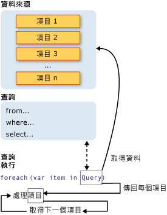

# Introduction to LINQ Queries (C#)
[!INCLUDE[vs2017banner](../../../../csharp/includes/vs2017banner.md)]

「*查詢*」\(Query\) 是一種從資料來源擷取資料的運算式，  而且使用專用的查詢語言來表示。  一段時間之後，針對不同類型的資料來源已開發出不同的語言，例如 SQL 是用於關聯式資料庫，而 XQuery 則是 XML。  因此，開發人員必須針對他們所需支援的資料來源類型或資料格式學習新的查詢語言。  [!INCLUDE[vbteclinq](../../../../csharp/includes/vbteclinq_md.md)] 提供一致的模型來使用各種資料來源和格式的資料，從而簡化此情況。  在 [!INCLUDE[vbteclinq](../../../../csharp/includes/vbteclinq_md.md)] 查詢中，您所處理的一定是物件。  不論您要查詢及轉換的資料是存在 XML 文件、SQL 資料庫、[!INCLUDE[vstecado](../../../../csharp/programming-guide/concepts/linq/includes/vstecado_md.md)] 資料集，還是 .NET 集合，以及其他任何有可用 [!INCLUDE[vbteclinq](../../../../csharp/includes/vbteclinq_md.md)] 提供者 \(Provider\) 的格式中，都是使用相同的基本程式碼撰寫模式。  
  
## 查詢作業的三個部分  
 所有的 [!INCLUDE[vbteclinq](../../../../csharp/includes/vbteclinq_md.md)] 查詢作業都包含三個不同的動作：  
  
1.  取得資料來源。  
  
2.  建立查詢。  
  
3.  執行查詢。  
  
 下列範例示範查詢作業的三個部分在原始程式碼中的表示方式。  為了方便起見，這個範例使用整數陣列做為資料來源；不過，相同的概念也適用於其他資料來源。  本主題其他部分都會參照到這個範例。  
  
 [!CODE [CsLINQGettingStarted#1](../CodeSnippet/VS_Snippets_VBCSharp/CsLINQGettingStarted#1)]  
  
 下圖顯示完整的查詢作業。  在 [!INCLUDE[vbteclinq](../../../../csharp/includes/vbteclinq_md.md)] 中，查詢的執行與查詢本身不同；也就是說，只建立查詢變數並不能擷取任何資料。  
  
   
  
## 資料來源  
 在前述範例中，因為資料來源是陣列，所以它已隱含泛型 <xref:System.Collections.Generic.IEnumerable%601> 介面的支援。  這表示它可以使用 [!INCLUDE[vbteclinq](../../../../csharp/includes/vbteclinq_md.md)] 進行查詢。  查詢在 `foreach` 陳述式中執行，而且 `foreach` 需要有 <xref:System.Collections.IEnumerable> 或 <xref:System.Collections.Generic.IEnumerable%601>。  支援 <xref:System.Collections.Generic.IEnumerable%601> 或衍生介面 \(例如泛型 <xref:System.Linq.IQueryable%601>\) 的類型稱為「*可查詢類型*」\(Queryable Type\)。  
  
 可查詢類型不需要進行修改或特殊處理，就可以當成 [!INCLUDE[vbteclinq](../../../../csharp/includes/vbteclinq_md.md)] 資料來源。  如果來源資料還不是記憶體中的可查詢類型，[!INCLUDE[vbteclinq](../../../../csharp/includes/vbteclinq_md.md)] 提供者必須將它表示為可查詢類型。  例如，[!INCLUDE[sqltecxlinq](../../../../csharp/programming-guide/concepts/linq/includes/sqltecxlinq_md.md)] 會將 XML 文件載入可查詢的 <xref:System.Xml.Linq.XElement> 類型中：  
  
 [!CODE [CsLINQGettingStarted#2](../CodeSnippet/VS_Snippets_VBCSharp/CsLINQGettingStarted#2)]  
  
 使用 [!INCLUDE[vbtecdlinq](../../../../csharp/includes/vbtecdlinq_md.md)] 時，請先在設計階段利用手動方式或[物件關聯式設計工具 \(O\/R 設計工具\)](/visual-studio/data-tools/linq-to-sql-tools-in-visual-studio2)，建立物件關聯對應。  您可以針對物件撰寫查詢，而 [!INCLUDE[vbtecdlinq](../../../../csharp/includes/vbtecdlinq_md.md)] 則會在執行階段處理與資料庫之間的通訊。  在下列範例中，`Customers` 代表資料庫中的特定資料表，而查詢結果的類型 <xref:System.Linq.IQueryable%601> 則衍生自 <xref:System.Collections.Generic.IEnumerable%601>。  
  
```c#  
Northwnd db = new Northwnd(@"c:\northwnd.mdf");  
  
// Query for customers in London.  
IQueryable<Customer> custQuery =  
    from cust in db.Customers  
    where cust.City == "London"  
    select cust;  
  
```  
  
 如需如何建立特定資料來源類型的詳細資訊，請參閱各種 [!INCLUDE[vbteclinq](../../../../csharp/includes/vbteclinq_md.md)] 提供者的文件。  不過，基本規則十分簡單：[!INCLUDE[vbteclinq](../../../../csharp/includes/vbteclinq_md.md)] 資料來源是支援泛型 <xref:System.Collections.Generic.IEnumerable%601> 介面的物件，或是繼承自此泛型介面的介面。  
  
> [!NOTE]
>  諸如 <xref:System.Collections.ArrayList> 等支援非泛型 <xref:System.Collections.IEnumerable> 介面的類型，也可以當成 [!INCLUDE[vbteclinq](../../../../csharp/includes/vbteclinq_md.md)] 資料來源使用。  如需詳細資訊，請參閱[How to: Query an ArrayList with LINQ](../Topic/How%20to:%20Query%20an%20ArrayList%20with%20LINQ.md)。  
  
##  <a name="query"></a> 查詢  
 查詢可指定要從一個或多個資料來源擷取的資訊，  也可選擇指定該資訊在傳回之前所應採用的排序、群組方式和外形。  查詢是儲存在查詢變數中，並以查詢運算式初始化。  為了簡化撰寫查詢的程序，C\# 已引入新的查詢語法。  
  
 前述範例中的查詢會傳回整數陣列中的所有偶數。  查詢運算式包含三個子句：`from`、`where` 和 `select` \(如果您熟悉 SQL，應該已注意到這些子句的排序與 SQL 中的排序相反\)。`from` 子句指定資料來源，`where` 子句套用篩選條件，而 `select` 子句則指定傳回項目的類型。  [LINQ 查詢運算式](../../../../csharp/programming-guide/linq-query-expressions/index.md) 章節中將會詳細討論這些查詢子句和其他查詢子句。  現在的重點是，在 [!INCLUDE[vbteclinq](../../../../csharp/includes/vbteclinq_md.md)] 中，查詢變數本身不會進行任何動作，也不會傳回任何資料，  它只會儲存稍後執行查詢以產生結果時所需要的資訊。  如需如何在幕後建構查詢的詳細資訊，請參閱[Standard Query Operators Overview](../../../../visual-basic/programming-guide/concepts/linq/standard-query-operators-overview.md)。  
  
> [!NOTE]
>  查詢可以使用方法語法來表示。  如需詳細資訊，請參閱[Query Syntax and Method Syntax in LINQ](../../../../csharp/programming-guide/concepts/linq/query-syntax-and-method-syntax-in-linq.md)。  
  
## 查詢執行  
  
### 延後執行  
 如前面所述，查詢變數本身只會儲存查詢命令。  實際執行查詢的作業將會延後至您反覆查看 `foreach` 陳述式中的查詢變數為止。  這個概念稱為「*延後執行*」\(Deferred Execution\)，下列範例將加以示範：  
  
 [!CODE [csLinqGettingStarted#4](../CodeSnippet/VS_Snippets_VBCSharp/CsLINQGettingStarted#4)]  
  
 `foreach` 陳述式也是擷取查詢變數的地方。  例如，在前述查詢中，反覆運算變數 `num` 會保留傳回序列中的每個值 \(一次一個\)。  
  
 因為查詢變數本身並不會保留查詢結果，所以您可以隨意多次執行查詢變數。  例如，您的資料庫可能是由另一個應用程式持續更新。  在您的應用程式中，您可以建立一個會擷取最新資料的查詢，並按照特定的間隔執行該項查詢，以擷取不同的結果。  
  
### 強制立即執行  
 針對某個來源項目範圍執行彙總函式的查詢必須先反覆查看這些項目。  這類查詢的範例包括 `Count`、`Max`、`Average` 和 `First`。  這些查詢執行時並未使用明確的 `foreach` 陳述式，因為查詢本身必須使用 `foreach` 才能傳回結果。  另外也請注意，這些查詢類型傳回的是單一的值，而不是 `IEnumerable` 集合。  下列查詢會傳回來源陣列中的偶數計數：  
  
 [!CODE [csLinqGettingStarted#5](../CodeSnippet/VS_Snippets_VBCSharp/CsLINQGettingStarted#5)]  
  
 若要強制立即執行任何查詢並快取其結果，您可以呼叫 <xref:System.Linq.Enumerable.ToList%2A> 或 <xref:System.Linq.Enumerable.ToArray%2A> 方法。  
  
 [!CODE [csLinqGettingStarted#6](../CodeSnippet/VS_Snippets_VBCSharp/CsLINQGettingStarted#6)]  
  
 您也可以將 `foreach` 迴圈放在緊接著查詢運算式後方的位置，以強制執行查詢。  不過，透過呼叫 `ToList` 或 `ToArray`，您可同時快取單一集合物件中的所有資料。  
  
## 請參閱  
 [Getting Started with LINQ in C\#](../../../../csharp/programming-guide/concepts/linq/getting-started-with-linq.md)   
 [Walkthrough: Writing Queries in C\#](../../../../csharp/programming-guide/concepts/linq/walkthrough-writing-queries-linq.md)   
 [LINQ 範例](../Topic/LINQ%20Samples.md)   
 [O\/R 設計工具概觀](../Topic/LINQ%20to%20SQL%20Tools%20in%20Visual%20Studio1.md)   
 [LINQ 查詢運算式](../../../../csharp/programming-guide/linq-query-expressions/index.md)   
 [foreach、in](../../../../csharp/language-reference/keywords/foreach-in.md)   
 [查詢關鍵字 \(LINQ\)](../../../../csharp/language-reference/keywords/query-keywords.md)   
 [LINQ 與延後執行影片](http://go.microsoft.com/fwlink/?LinkId=112414)