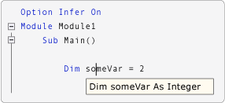

# Option Infer Statement
[!INCLUDE[vs2017banner](../../../csharp/includes/vs2017banner.md)]

可讓您在宣告變數時使用區域類型推斷。  
  
## 語法  
  
```  
Option Infer { On | Off }  
```  
  
## 組件  
  
|||  
|-|-|  
|詞彙|定義|  
|`On`|選擇項。  啟用區域類型推斷。|  
|`Off`|選擇項。  停用區域類型推斷。|  
  
## 備註  
 若要在檔案中設定 `Option Infer`，請在檔案頂端的任何其他原始程式碼之前輸入 `Option Infer On` 或 `Option Infer Off`。  如果在檔案中設定給 `Option Infer` 的值與 IDE 或命令列中設定的值衝突，檔案中的值具有優先權。  
  
 當您將 `Option Infer` 設定為 `On` 時，可以宣告區域變數而不用明確陳述資料類型。  編譯器會從其初始化運算式的類型推斷變數的資料類型。  
  
 在下圖中，`Option Infer` 已開啟。  宣告 `Dim someVar = 2` 中的變數依類型推斷宣告為整數。  
  
   
Option Infer 開啟時的 IntelliSense  
  
 在下圖中，`Option Infer` 已關閉。  宣告 `Dim someVar = 2` 中的變數依類型推斷宣告為 `Object`。  在這個範例中，\[Option Strict\] 設定在 [專案設計工具、編譯頁 \(Visual Basic\)](/visual-studio/ide/reference/compile-page-project-designer-visual-basic) 上設定為 \[關閉\]。  
  
   
Option Infer 關閉時的 IntelliSense  
  
> [!NOTE]
>  當變數被宣告為 `Object` 時，執行階段類型可以在程式執行時變更。  [!INCLUDE[vbprvb](../../../csharp/programming-guide/concepts/linq/includes/vbprvb_md.md)] 會執行稱為 *「boxing」*\(boxing\) 和 *「unboxing」*\(unboxing\) 的作業，在 `Object` 與值類型之間轉換，這會使得執行速度變慢。  如需 boxing 和 unboxing 的詳細資訊，請參閱 [Visual Basic Language Specification](../../../visual-basic/reference/language-specification.md)。  
  
 類型推斷會套用在程序層級，不會套用在類別、結構、模組或介面中的程序之外。  
  
 如需詳細資訊，請參閱 [Local Type Inference](../../../visual-basic/programming-guide/language-features/variables/local-type-inference.md)。  
  
## Option Infer 陳述式不存在時  
 如果原始程式碼不包含 `Option Infer` 陳述式，會使用 [專案設計工具、編譯頁 \(Visual Basic\)](/visual-studio/ide/reference/compile-page-project-designer-visual-basic)上的 \[Option Infer\] 設定。  如果使用命令列編譯器，會使用 [\/optioninfer](../../../visual-basic/reference/command-line-compiler/optioninfer.md) 編譯器選項。  
  
#### 在 IDE 中設定 Option Infer  
  
1.  在 \[方案總管\] 中選取專案。  在 \[專案\] 功能表上，按一下 \[屬性\]。  如需詳細資訊，請參閱[NIB: Managing Project Properties with the Project Designer](http://msdn.microsoft.com/zh-tw/983f3c18-832f-4666-afec-74b716ff3e0e)。  
  
2.  按一下 \[編譯\] 索引標籤。  
  
3.  在 \[Option Infer\] 方塊中設定值。  
  
 當您建立新專案時，\[編譯\] 索引標籤上的 \[Option Infer\] 設定會設定為 \[VB 預設值\] 對話方塊中的 \[Option Infer\] 設定。  若要存取 \[VB 預設值\] 對話方塊，請在 \[工具\] 功能表中，按一下 \[選項\]。  在\[選項\] 對話方塊中，展開 \[專案和方案\]，然後按一下 \[VB 預設值\]。  \[VB 預設值\] 中的初始預設設定是 `On`。  
  
#### 在命令列上設定 Option Infer  
  
-   在 **vbc** 命令中併入 [\/optioninfer](../../../visual-basic/reference/command-line-compiler/optioninfer.md) 編譯器選項。  
  
## 預設資料類型和值  
 下表說明在 `Dim` 陳述式中指定資料類型和初始設定式的各種組合結果。  
  
|||||  
|-|-|-|-|  
|指定了資料類型？|指定了初始設定式？|範例|結果|  
|否|否|`Dim qty`|如果 `Option Strict` 已關閉 \(預設值\)，此變數會設定為 `Nothing`。<br /><br /> 如果 `Option Strict` 已開啟，就會發生編譯時期錯誤。|  
|否|是|`Dim qty = 5`|如果 `Option Infer` 已開啟 \(預設值\)，此變數會採用初始設定式的資料類型。  請參閱 [Local Type Inference](../../../visual-basic/programming-guide/language-features/variables/local-type-inference.md)。<br /><br /> 如果 `Option Infer` 已關閉，且 `Option Strict` 也已關閉，此變數會採用 `Object` 的資料類型。<br /><br /> 如果 `Option Infer` 已關閉，但是 `Option Strict` 已開啟，就會發生編譯時期錯誤。|  
|是|否|`Dim qty As Integer`|變數會初始化為資料類型的預設值。  如需詳細資訊，請參閱[Dim Statement](../../../visual-basic/language-reference/statements/dim-statement.md)。|  
|是|是|`Dim qty  As Integer = 5`|如果初始設定式的資料類型無法轉換成指定的資料類型，就會發生編譯時期錯誤。|  
  
## 範例  
 下列範例示範 `Option Infer` 陳述式如何啟用區域類型推斷。  
  
 [!CODE [VbVbalrTypeInference#6](../CodeSnippet/VS_Snippets_VBCSharp/VbVbalrTypeInference#6)]  
  
## 範例  
 下列範例示範當變數被視為 `Object` 時，執行階段類型可能會不同。  
  
 [!CODE [VbVbalrTypeInference#11](../CodeSnippet/VS_Snippets_VBCSharp/VbVbalrTypeInference#11)]  
  
## 請參閱  
 [Dim Statement](../../../visual-basic/language-reference/statements/dim-statement.md)   
 [Local Type Inference](../../../visual-basic/programming-guide/language-features/variables/local-type-inference.md)   
 [Option Compare Statement](../../../visual-basic/language-reference/statements/option-compare-statement.md)   
 [Option Explicit Statement](../../../visual-basic/language-reference/statements/option-explicit-statement.md)   
 [Option Strict Statement](../../../visual-basic/language-reference/statements/option-strict-statement.md)   
 [選項對話方塊、專案、Visual Basic 預設值](/visual-studio/ide/reference/visual-basic-defaults-projects-options-dialog-box)   
 [\/optioninfer](../../../visual-basic/reference/command-line-compiler/optioninfer.md)   
 [Boxing 和 Unboxing](../../../csharp/programming-guide/types/boxing-and-unboxing.md)