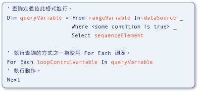

# Type Relationships in Query Operations (Visual Basic)
[!INCLUDE[vs2017banner](../../../../csharp/includes/vs2017banner.md)]

[!INCLUDE[vbteclinqext](../../../../csharp/getting-started/includes/vbteclinqext_md.md)] 查詢作業中使用的變數是強型別 \(Strongly Typed\)，而且必須彼此相容。  強型別會用於資料來源、查詢本身和查詢執行中。  下圖識別用來描述 [!INCLUDE[vbteclinq](../../../../csharp/includes/vbteclinq_md.md)] 查詢的詞彙。  如需查詢中各部分的詳細資訊，請參閱[基本查詢作業 \(Visual Basic\)](../../../../visual-basic/programming-guide/concepts/linq/basic-query-operations.md)。  
  
   
LINQ 查詢的部分  
  
 首先，查詢中範圍變數的型別必須與資料來源中項目的型別相容。  其次，查詢變數的型別必須與 `Select` 子句中定義的序列項目相容。  最後，序列項目的型別也必須與執行查詢的 `For Each` 陳述式中，所使用迴圈 \(Loop\) 控制變數的型別相容。  這類強型別作業可以方便在編譯時期識別出型別錯誤。  
  
 [!INCLUDE[vbprvb](../../../../csharp/programming-guide/concepts/linq/includes/vbprvb_md.md)] 實作了區域型推斷，也稱為「*隱含型別*」\(Implicit Type\)，使強型別作業更方便。  上一個範例中使用了這項功能，而且您也會在許多 [!INCLUDE[vbteclinq](../../../../csharp/includes/vbteclinq_md.md)] 範例和文件中看到它。  在 Visual Basic 中，區域型別推斷是透過不含 `As` 子句的單純 `Dim` 陳述式來完成。  在下列範例中，`city` 會強型別為字串。  
  
 [!CODE [VbLINQTypeRels#1](../CodeSnippet/VS_Snippets_VBCSharp/VbLINQTypeRels#1)]  
  
> [!NOTE]
>  只有在 `Option Infer` 設定為 `On` 時，才可以進行區域型別推斷。  如需詳細資訊，請參閱 [Option Infer Statement](../../../../visual-basic/language-reference/statements/option-infer-statement.md)。  
  
 不過，即使在查詢中使用區域型別推斷，在資料來源、查詢變數和查詢執行迴圈的變數之間還是會保持相同的型別關聯性 \(Relationship\)。  在您撰寫 [!INCLUDE[vbteclinq](../../../../csharp/includes/vbteclinq_md.md)] 查詢時，或使用文件中的範例和程式碼範例時，對這些型別關聯性有基本的了解會很有用。  
  
 您可能需要為不符合資料來源所傳回型別的範圍變數，指定明確型別。  您可以使用 `As` 子句來指定範圍變數的型別。  不過，如果轉換是[縮小轉換](../../../../visual-basic/programming-guide/language-features/data-types/widening-and-narrowing-conversions.md)，且 `Option Strict` 設為 `On`，則會產生錯誤。  因此，建議您對從資料來源擷取的值執行轉換。  您可以使用 <xref:System.Linq.Enumerable.Cast%2A> 方法，將來自資料來源的值轉換為明確範圍變數型別。  您也可以將 `Select` 子句中選取的值，轉型為不同於範圍變數型別的明確型別。  以下程式碼會解釋這些重點。  
  
 [!CODE [VbLINQTypeRels#4](../CodeSnippet/VS_Snippets_VBCSharp/VbLINQTypeRels#4)]  
  
## 傳回來源資料中之完整項目的查詢  
 下列範例顯示的 [!INCLUDE[vbteclinq](../../../../csharp/includes/vbteclinq_md.md)] 查詢作業會傳回從來源資料中選取之項目的序列。  來源 \(`names`\) 包含的是字串陣列，而查詢輸出的序列則包含以 M 字母開頭的字串。  
  
 [!CODE [VbLINQTypeRels#2](../CodeSnippet/VS_Snippets_VBCSharp/VbLINQTypeRels#2)]  
  
 這個效果相當於下列程式碼，但是比較簡短也比較容易撰寫。  依賴查詢中的區域型別推斷是 Visual Basic 的慣用風格。  
  
 [!CODE [VbLINQTypeRels#3](../CodeSnippet/VS_Snippets_VBCSharp/VbLINQTypeRels#3)]  
  
 不論型別是以隱含還是明確的方式決定，前面兩個程式碼範例中都存在下列關聯性。  
  
1.  資料來源中項目的型別 \(`names`\) 是查詢中範圍變數的型別 \(`name`\)。  
  
2.  所選取物件的型別 \(`name`\) 會決定查詢變數的型別 \(`mNames`\)。  這裡的 `name` 是字串，因此查詢變數在 Visual Basic 中是 IEnumerable\(Of String\)。  
  
3.  `mNames` 中定義的查詢會在 `For Each` 迴圈中執行。  這個迴圈會逐一查看查詢的執行結果。  因為 `mNames` 在執行時會傳回字串的序列，所以迴圈反覆運算變數 `nm` 也會是字串。  
  
## 從所選取項目傳回一個欄位的查詢  
 下列範例顯示的 [!INCLUDE[vbtecdlinq](../../../../csharp/includes/vbtecdlinq_md.md)] 查詢作業，會傳回只包含從資料來源中選取之每個項目的某一部分的序列。  這個查詢會採用 `Customer` 物件的集合做為它的資料來源，而且只在結果中規劃 `Name` 屬性。  因為客戶名稱是字串，所以查詢會產生字串的序列做為輸出。  
  
<CodeContentPlaceHolder>0</CodeContentPlaceHolder>  
 變數之間的關聯性與簡單版範例中的關聯性類似。  
  
1.  資料來源 \(`customers`\) 中項目的型別就是查詢中範圍變數 \(`cust`\) 的型別。  在這個範例中，該型別是 `Customer`。  
  
2.  `Select` 陳述式會傳回每個 `Customer` 物件的 `Name` 屬性，而不是整個物件。  同樣地，因為 `Name` 是字串，所以查詢變數 \(`custNames`\) 會是 IEnumerable\(Of String\)，而不是 `Customer`。  
  
3.  因為 `custNames` 表示字串的序列，所以 `For Each` 迴圈的反覆運算變數 \(`custName`\) 必須是字串。  
  
 如果沒有區域型別推斷，上一個範例就會非常冗長也較難了解，如下列範例所示。  
  
<CodeContentPlaceHolder>1</CodeContentPlaceHolder>  
## 需要匿名型別的查詢  
 下列範例顯示較複雜的狀況。  在上一個範例中，還是可以明確指定所有變數的型別，雖然並不是很容易。  但是在這個範例中，則根本不可能。  這個查詢中的 `Select` 子句會傳回原始 `Customer` 物件的兩個屬性 \(`Name` 和 `City`\)，而不是選取資料來源中的完整 `Customer` 項目，或選取每個項目中單一欄位。  遇到這個 `Select` 子句時，編譯器 \(Compiler\) 會定義包含這兩個屬性的匿名型別。  在 `For Each` 迴圈中執行 `nameCityQuery` 會得到新匿名型別的執行個體 \(Instance\) 集合。  因為匿名型別沒有可用的名稱，所以無法明確指定 `nameCityQuery` 或 `custInfo` 的型別。  也就是說，如果使用匿名型別，就沒有型別名稱可用來取代 `IEnumerable(Of String)` 中的 `String`。  如需詳細資訊，請參閱[Anonymous Types](../../../../visual-basic/programming-guide/language-features/objects-and-classes/anonymous-types.md)。  
  
<CodeContentPlaceHolder>2</CodeContentPlaceHolder>  
 雖然無法指定上一個範例中所有變數的型別，但是關聯性還是會維持不變。  
  
1.  同樣地，資料來源中項目的型別會是查詢中範圍變數的型別。  在這個範例中，`cust` 是 `Customer` 的執行個體。  
  
2.  因為 `Select` 陳述式會產生匿名型別，所以查詢變數 \(`nameCityQuery`\) 必須隱含地設為匿名型別。  匿名型別沒有可用的名稱，因此無法明確加以指定。  
  
3.  `For Each` 迴圈中反覆運算變數的型別，是步驟 2 所建立的匿名型別。  因為此型別沒有可用名稱，所以迴圈反覆運算變數的型別必須以隱含的方式決定。  
  
## 請參閱  
 [Getting Started with LINQ in Visual Basic](../../../../visual-basic/programming-guide/concepts/linq/getting-started-with-linq.md)   
 [Anonymous Types](../../../../visual-basic/programming-guide/language-features/objects-and-classes/anonymous-types.md)   
 [Local Type Inference](../../../../visual-basic/programming-guide/language-features/variables/local-type-inference.md)   
 [Introduction to LINQ in Visual Basic](../../../../visual-basic/programming-guide/language-features/linq/introduction-to-linq.md)   
 [LINQ](../../../../visual-basic/programming-guide/language-features/linq/index.md)   
 [Queries](../../../../visual-basic/language-reference/queries/queries.md)