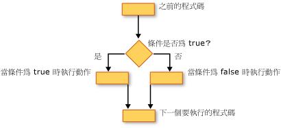

# Decision Structures (Visual Basic)
[!INCLUDE[vs2017banner](../../../../csharp/includes/vs2017banner.md)]

[!INCLUDE[vbprvb](../../../../csharp/programming-guide/concepts/linq/includes/vbprvb_md.md)] 可以讓您測試條件，並根據測試的結果執行不同的作業。  您可以測試條件為 True 或 False、運算式的各種值或執行一系列陳述式時產生的各種例外狀況。  
  
 下圖將顯示一項決策結構，此結構可測試條件是否為 true 並根據條件為 true 或 false 而採取不同的動作。  
  
   
當條件為 true 或 false 時分別採取不同的動作  
  
## If...Then...Else 建構  
 `If...Then...Else` 語法建構可讓您測試一個或多個條件，並根據每個條件執行一個或多個陳述式。  您可以測試條件並以下列方式採取行動：  
  
-   若條件為 `True`，則執行一個或多個陳述式  
  
-   若條件為 `False`，則執行一個或多個陳述式  
  
-   若某個條件為 `True` 而其他條件為 `False`，則執行某些陳述式  
  
-   若先前的條件為 `False`，則測試其他條件  
  
 提供所有可能性的控制結構為 [If...Then...Else Statement](../../../../visual-basic/language-reference/statements/if-then-else-statement.md)。  若您只需要執行一項測試與一個陳述式，可以使用單行版本。  如果您有更複雜的條件與動作組合，則可以使用多行版本。  
  
## Select...Case 建構  
 `Select...Case` 語法建構可以讓您評估運算式一次，並且根據不同的可能值執行不同的陳述式組。  如需詳細資訊，請參閱[Select...Case Statement](../../../../visual-basic/language-reference/statements/select-case-statement.md)。  
  
## Try...Catch...Finally 建構  
 如果有任何陳述式引起例外狀況，`Try...Catch...Finally` 建構可以讓您在保留控制項的環境下執行一組陳述式。  您可以針對不同的例外狀況採取不同的動作。  在任何情況下，您都可以在結束整個 `Try...Catch...Finally` 語法建構之前選擇性指定要執行的程式碼區塊。  如需詳細資訊，請參閱[Try...Catch...Finally Statement](../../../../visual-basic/language-reference/statements/try-catch-finally-statement.md)。  
  
> [!NOTE]
>  對於許多控制結構來說，當您按一下關鍵字時，就會將該結構中的所有關鍵字反白顯示。  例如，當您按一下 `If...Then...Else` 建構中的 `If` 時，就會將該建構中 `If`、`Then`、`ElseIf`、`Else` 和  `End If` 的所有執行個體反白顯示。  若要移至下一個或上一個反白顯示的關鍵字，請按 CTRL\+SHIFT\+向下鍵或 CTRL\+SHIFT\+向上鍵。  
  
## 請參閱  
 [Control Flow](../../../../visual-basic/programming-guide/language-features/control-flow/index.md)   
 [Loop Structures](../../../../visual-basic/programming-guide/language-features/control-flow/loop-structures.md)   
 [Other Control Structures](../../../../visual-basic/programming-guide/language-features/control-flow/other-control-structures.md)   
 [Nested Control Structures](../../../../visual-basic/programming-guide/language-features/control-flow/nested-control-structures.md)   
 [If Operator](../../../../visual-basic/language-reference/operators/if-operator.md)